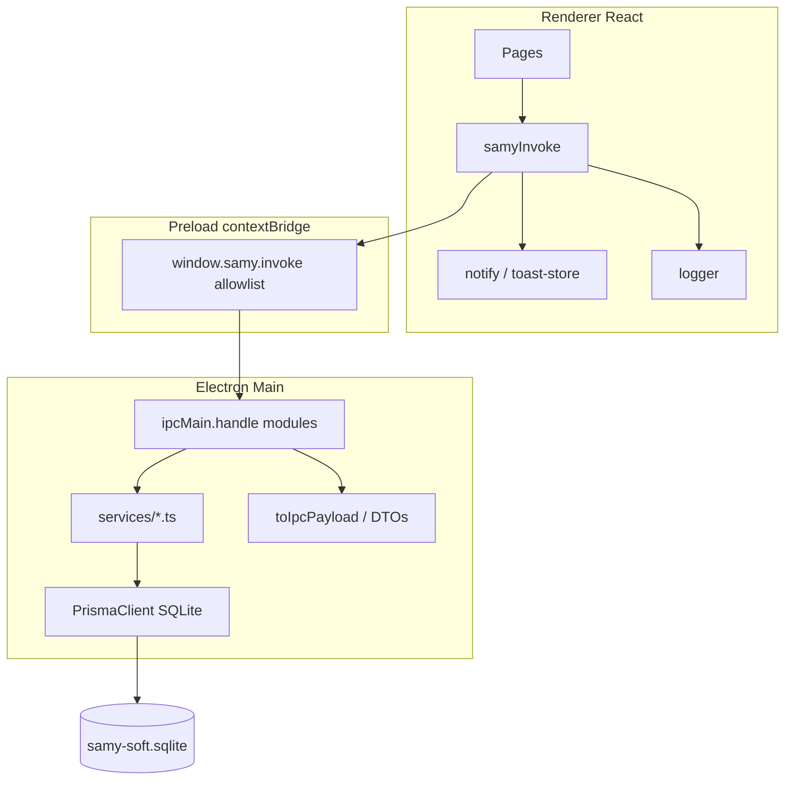

# SAMY SOFT ERP — Full Application Stability Audit

**Date:** 2026-05-18  
**Version audited:** 0.2.0  
**Scope:** Electron main/preload, IPC, Prisma/SQLite, React renderer (all modules)

---

## Executive summary

SAMY SOFT is a local-first industrial ERP (inventory, production, sales, HR/payroll, reporting, settings) built as **Electron + React + Prisma/SQLite**. The codebase is functionally broad but exhibits **prototype-grade reliability**: IPC serialization gaps, inconsistent error UX, manual data-fetching without a query layer, and a **dual database migration path** (bootstrap SQL vs stale `prisma/migrations`).

This audit inspected architecture boundaries, module handlers, frontend patterns, and schema integrity. **Critical IPC clone failures were fixed** in production recipes and sales products. **Stability infrastructure** was added (centralized logger, notify helpers, IPC utils, DataTable loading, production cache prefix).

**Production readiness estimate:** **62%** — core flows work for a controlled pilot; not yet enterprise-hardened without addressing migration drift, table-level UX, and systematic DTO coverage.

---

## Verification performed

| Check | Result |
|-------|--------|
| `npm run lint` (3× TS projects) | ✅ Pass |
| `npx prisma validate` | ✅ Pass |
| `npm run test:unit` | ✅ 6/6 tests |
| `npm run build:electron` + preload | ✅ Pass |
| `vite build` | ✅ Pass |
| Electron GUI smoke (headless) | ⚠️ Not confirmed (Windows `Start-Process npx` limitation) |
| Playwright E2E full navigation | ⚠️ Not run in this session (`npm run e2e` available) |

---

## Architecture overview



**Strengths**

- `contextIsolation: true`, `nodeIntegration: false` in production
- IPC channel allowlist in preload (`IPC_CHANNELS`)
- Zod validation on most handler inputs
- `data-integrity-service` business scans
- Bootstrap schema for greenfield packaged installs
- Inventory domain uses DTOs + `toIpcPayload`

**Weaknesses**

- Serialization enforcement is **inventory-only**; other domains rely on ad-hoc mappers
- No React Query / normalized cache — `useEffect` + local state everywhere
- Single global error boundary
- Migration folder **out of sync** with `schema.prisma`
- Many list pages: toast-only errors, no loading skeletons

---

## Module audit

### 1. Inventory

| Area | Status | Notes |
|------|--------|-------|
| Raw materials | ✅ Good | DTOs + `toIpcPayload`; inline qty edit |
| Packaging | ✅ Good | Same as raw |
| Suppliers | ⚠️ Mixed | List uses DTO; get/upsert use `toIpcPayload` on raw Prisma graph |
| Purchases | ✅ Good | DTO on create/list |
| Stock movements | ✅ Good | Scalar serialization |
| Stock alerts / nav counts | ✅ Good | Serialized summaries |
| Valuation / expiration | ⚠️ Partial | Dashboard summary cached; expiration in nav counts |
| Reports CSV | ✅ Good | String CSV over IPC |

**Risks:** Supplier detail payloads are large; prefer dedicated supplier DTO for get/upsert (like list).

### 2. Production

| Area | Status | Notes |
|------|--------|-------|
| Recipes / BOM | ✅ Fixed | Upsert/duplicate now return `serializeRecipeMeta` (was raw Prisma → clone error) |
| Batch creation | ✅ Good | Validated schemas; inventory invalidation on complete |
| Consumption / shortages | ✅ Good | Decimal serialized in preview |
| Yields / waste | ✅ Good | Movement kinds validated |
| Production logs | ✅ Good | Mixer operation logs |
| Reports | ⚠️ Partial | CSV exports; dashboard uses `console.error` only |

**Risks:** No `invalidateProductionCaches()` wired on mutations yet (prefix added, adoption pending).

### 3. Sales

| Area | Status | Notes |
|------|--------|-------|
| Invoices | ✅ Good | `serializeInvoice`; validate triggers stock deduction |
| Clients | ✅ Good | Date serialization |
| Payments | ✅ Good | Cascade on invoice |
| Totals | ✅ Good | Service-layer calculations |
| Stock deduction | ✅ Good | On validate via inventory movements |
| Products | ✅ Fixed | List/get nested `packagingMaterial`/`recipe` now brief DTOs |

**Risks:** Invoice list picker loads (`void samyInvoke`) can fail silently; sales reports lack export busy state.

### 4. RH & Payroll

| Area | Status | Notes |
|------|--------|-------|
| Employee forms | ✅ Good | RHF + Zod |
| Calculations | ✅ Good | `payroll-engine` aligned with enums |
| Persistence | ✅ Good | RESTRICT on worker delete |
| Reports | ✅ Good | CSV + busy keys on HR report pages |
| Attendance | ⚠️ Partial | Calendar/day pages; complex state |

**Risks:** Workers list has error state but no loading; payroll cycle orphan possible (`payrollCycleId` SET NULL).

### 5. Reports

| Area | Status | Notes |
|------|--------|-------|
| Loading | ⚠️ Mixed | Journal has loading; analytics fires 4 IPCs with toast-only failures |
| Filters | ✅ Good | Zod + preset service |
| Exports | ✅ Good | PDF/XLSX base64 |
| Aggregation | ⚠️ Review | `reporting-analytics` — spot-check against ledger in pilot |

### 6. Internal quality (QA)

| Area | Status | Notes |
|------|--------|-------|
| QA dashboard | ✅ Good | Overview IPC |
| Data integrity scan | ✅ Good | `db:data-integrity:scan` |
| Forms | N/A | Read-only metrics |

### 7. Settings

| Area | Status | Notes |
|------|--------|-------|
| Save/load | ✅ Good | Upsert + get-all |
| Persistence | ✅ Good | `AppSetting` key-value |
| Permissions | ✅ Good | Role-based via `PERMISSIONS` |
| Workstation | ✅ Good | Hostname/platform IPC |
| Backup/maintenance | ✅ Good | Explicit busy flags |

**Risks:** `refreshSettingsSilently` swallows errors (no toast).

---

## Global inspection results

### A. Runtime stability

| Item | Finding |
|------|---------|
| IPC channels | ~100 channels in `shared/ipc-channels.ts`; all `ipcMain.handle` |
| Serialization | **Fixed:** production recipe upsert/duplicate, sales product get/list |
| Unhandled rejections | Main process logs `unhandledRejection`; handlers are async (reject → renderer) |
| Silent failures | Many `.catch(console.error)` / empty catches on secondary loads |
| Preload safety | Allowlist + `contextBridge`; E2E disables isolation (test-only) |
| Async error handling | `logActivity` awaited; bootstrap admin uses `captureMainProcessError` |

### B. Database integrity

| Item | Finding |
|------|---------|
| Models / enums | 42 models, 21 enums — valid |
| Runtime init | `bootstrap-schema.sql` via `database-schema-service` |
| Migrations | **CRITICAL DRIFT:** `migrate deploy` chain incomplete vs schema |
| Orphans | Polymorphic `StockMovement.reference*`; SET NULL on material delete |
| Cascades | Invoice items/payments cascade; recipe ingredients cascade |
| Integrity scan | `data-integrity-service` covers business rules |

### C. Frontend reliability

| Item | Finding |
|------|---------|
| Error boundary | Global `AppErrorBoundary` (enhanced with `logger`) |
| Toasts | Zustand `toast-store`; default IPC error toast |
| Loading states | **Added** `DataTable.loading`; most pages still lack list loading |
| Cache | TTL cache + prefix invalidation; only dashboard uses `cacheGetOrSet` |
| Routing | React Router lazy routes + Suspense fallback |

### D. Type safety

| Item | Finding |
|------|---------|
| Typecheck | Passes (3 TS projects) |
| `any` usage | Low in handlers; some `unknown` + Zod |
| DTO drift | Inventory DTOs only; production/sales ad-hoc |
| Decimals | Consistently `*Serialized` string fields at IPC boundary (after fixes) |

### E. IPC architecture

| Item | Finding |
|------|---------|
| Prisma over IPC | Mitigated by serializers; inventory uses `toIpcPayload` safety net |
| Central serialization | `electron/utils/serialize-for-ipc.ts` |
| Central validation | **Added** `electron/ipc/ipc-handler-utils.ts` (`parseIpcPayload`, `wrapIpcHandler`) |
| Error logging | **Added** optional wrapper; existing `captureMainProcessError` |

### F. UX consistency

| Item | Finding |
|------|---------|
| Save confirmation | Inconsistent — some pages toast success, others silent |
| Failure feedback | IPC failures toast; secondary loads often silent |
| Button states | Good on forms/settings; weak on report exports (sales) |
| Validation | RHF + Zod on major forms |

### G. Performance

| Item | Finding |
|------|---------|
| Duplicate queries | Pages re-fetch on mount; no shared cache |
| Tables | Virtualization ≥18 rows |
| Memory | No leak patterns found in IPC registration |
| Large lists | 500-item dropdown fetches (products page) |

### H. Security / stability

| Item | Finding |
|------|---------|
| contextIsolation | ✅ production |
| IPC input validation | Zod on payloads |
| Search/filter | Server-side `contains` — acceptable for local SQLite |
| Secrets | Logger sanitizes password fields |

---

## Bug list (categorized)

### Critical (fixed in this pass)

| ID | Issue | Affected files | Resolution |
|----|-------|----------------|------------|
| C-01 | Production recipe upsert returned raw Prisma (`Decimal`/`Date`) → IPC clone failure | `production-handlers.ts` | `serializeRecipeMeta()` |
| C-02 | Production recipe duplicate same as C-01 | `production-handlers.ts` | `serializeRecipeMeta()` |
| C-03 | Sales product get returned raw nested relations | `sales-handlers.ts` | `serializePackagingBrief` / `serializeRecipeBrief` |

### Critical (open)

| ID | Issue | Recommendation |
|----|-------|----------------|
| C-04 | `prisma/migrations` chain cannot bootstrap fresh DB matching schema | Regenerate migrations or document bootstrap-only deploy |
| C-05 | Phase12 migration references `Product` before creation | Squash/regenerate migration history |

### Major

| ID | Issue | Files | Recommendation |
|----|-------|-------|----------------|
| M-01 | Supplier get/upsert returns raw Prisma graph | `inventory-handlers.ts` | Add `SupplierDetailDto` |
| M-02 | No list-level loading states on most CRUD pages | `src/pages/**` | Adopt `DataTable.loading` + `loading` flags |
| M-03 | Secondary IPC loads fail silently (dropdowns) | `SalesInvoicesPage`, `SalesProductsPage`, etc. | Use `notifyIpcFailure` on catch |
| M-04 | Dual error UX (toast + inline) on some pages | HR dashboard, reporting center | Standardize: toast for IPC, inline for form |
| M-05 | `refreshSettingsSilently` swallows errors | `bootstrap.ts` | Log + optional toast |
| M-06 | Production cache never invalidated | production pages | Call `invalidateProductionCaches()` on writes |
| M-07 | Material delete SET NULL → orphan movements | schema + integrity scan | UI warnings before delete; periodic scan |

### Medium

| ID | Issue | Recommendation |
|----|-------|----------------|
| D-01 | No structured IPC error codes | Extend `ipc-handler-utils` with `IpcError` type |
| D-02 | `wrapIpcHandler` not adopted on existing handlers | Incremental migration |
| D-03 | Sales reports exports without busy state | Match inventory/HR report pages |
| D-04 | Analytics page 4 parallel IPCs, toast-only errors | Aggregate loading + error banner |
| D-05 | Topbar notifications placeholder | Implement or remove UI |
| D-06 | E2E mode weakens sandbox/isolation | Guard with `app.isPackaged` checks |

### Minor

| ID | Issue | Recommendation |
|----|-------|----------------|
| N-01 | `toastOnError: false` never used | Document pattern for secondary loads |
| N-02 | Home dashboard only consumer of TTL cache | Expand or simplify cache layer |
| N-03 | `recipeVersion` type drift in TS helpers | Align types with Prisma `Int` |
| N-04 | Prisma `package.json#prisma` deprecation warning | Plan `prisma.config.ts` migration |

---

## Fixes applied (this audit)

1. **`serializeRecipeMeta`** — production recipe upsert/duplicate IPC responses  
2. **`serializePackagingBrief` / `serializeRecipeBrief`** — sales product list/get  
3. **`electron/ipc/ipc-handler-utils.ts`** — `parseIpcPayload`, `wrapIpcHandler`, re-export `toIpcPayload`  
4. **`src/lib/logger.ts`** — centralized renderer logging  
5. **`src/lib/notify.ts`** + **`src/lib/ipc-errors.ts`** — toast helpers, IPC error formatting  
6. **`src/lib/samy.ts`** — uses logger + notify (no circular imports)  
7. **`DataTable`** — `loading` / `loadingLabel` props via `StaticTableMessage`  
8. **`CACHE_PREFIX.PRODUCTION`** + `invalidateProductionCaches()`  
9. **`AppErrorBoundary`** — uses `logger.error`  
10. **SalesProductsPage** — recipe options load logs error instead of silent empty  

---

## Recommended architecture fixes (complex)

### 1. Unified IPC DTO layer

Create `electron/ipc/dto/` per domain (mirror inventory):

- `production-dto.ts`, `sales-dto.ts`, `hr-dto.ts`
- Every handler returns explicit DTO types
- Run `findNonSerializableFields` in CI unit tests per handler

### 2. Renderer data layer

Introduce TanStack Query (already in ecosystem via table):

- Query keys per channel + filters
- `onSuccess` → domain cache invalidation
- Consistent `isLoading` / `isError` for tables

### 3. Single migration source of truth

Options:

- **A)** Ship only `bootstrap-schema.sql` + regenerate dated migrations from empty  
- **B)** Use `prisma db push` for dev; `migrate deploy` for prod after squash  

Document in README that packaged app **never** runs incomplete migration chain.

### 4. Route-level error boundaries

Wrap each layout (`InventoryLayout`, etc.) with `ModuleErrorBoundary` to avoid full-app reload on localized failures.

### 5. IPC error contract

```typescript
type IpcResult<T> =
  | { ok: true; data: T }
  | { ok: false; code: "AUTH" | "PERMISSION" | "VALIDATION" | "NOT_FOUND" | "INTERNAL"; message: string };
```

Migrate auth login pattern to all channels for predictable UI.

---

## Remaining risks

| Risk | Impact | Likelihood |
|------|--------|------------|
| Migration drift breaks `db:migrate` on new dev machines | High | Medium |
| Orphan stock movements after material delete | Medium | Medium |
| Silent dropdown failures in sales/invoices | Medium | High |
| Full-app crash on unhandled render error | Medium | Low |
| Pilot data corruption without pre-delete integrity scan | High | Low |

---

## Technical debt summary

1. **Dual schema application paths** (bootstrap vs migrations)  
2. **Inconsistent IPC serialization** across domains  
3. **Manual fetch/cache** without query library  
4. **UX inconsistency** (loading, success toasts, error surfaces)  
5. **Polymorphic references** without FK enforcement  
6. **Industrial expansion models** lightly used in UI  
7. **E2E / production security posture** divergence  

---

## Production readiness checklist

| Criterion | Ready? |
|-----------|--------|
| Typecheck / lint clean | ✅ |
| Prisma schema valid | ✅ |
| IPC clone-safe on critical writes | ✅ (after fixes) |
| Packaged install bootstrap | ✅ |
| Automated E2E smoke | ⚠️ Run `npm run e2e` before release |
| Migration story documented | ❌ |
| All modules loading/error UX | ❌ |
| Full DTO coverage | ❌ |
| Ops logging / diagnostics export | ✅ |
| Backup/restore verified on site | ⚠️ Manual QA |

**Estimated readiness: 62%** — suitable for **controlled pilot** with trained operators; recommend **2–3 week hardening sprint** (DTO migration, Query layer, migration squash, E2E gate) before wide production rollout.

---

## Next steps (priority order)

1. Run `npm run e2e` and fix any failing navigation/workflow tests  
2. Regenerate or squash `prisma/migrations` to match `schema.prisma`  
3. Extend DTOs to production, sales, HR handlers  
4. Adopt `DataTable.loading` on top 10 list pages  
5. Wire `invalidateProductionCaches()` on recipe/batch mutations  
6. Add module error boundaries  
7. Standardize success toasts on all save actions  

---

*Audit performed via static analysis, architecture review, and automated verification. Interactive GUI workflow testing should be completed with `npm run e2e` or manual operator checklist before release.*
